<picture>
  <source media="(prefers-color-scheme: dark)" srcset="./dark.svg">
  
</picture>

<p align="center">
  <a href="https://github.com/truedjentleman">
    
  </a>
</p>

---

### 👋 About

Infrastructure engineer working across **telecommunications, networking, connectivity, automation and large-scale systems**.

I enjoy turning complex infrastructure into systems that are easier to design, operate, automate and scale.

- ⚡ **Focus:** Infrastructure · Connectivity · Automation
- ☁️ **Interests:** Cloud · Data Centers · Distributed Systems
- 🧠 **Engineering:** Systems Design · Reliability · Observability
- 🐍 **Automation:** Python · APIs · Infrastructure Tooling
- 📍 **Based in:** Poland

---

### ⚙️ Engineering Focus

```text
Infrastructure
├── Networking & Connectivity
├── Telecom Systems
├── Cloud & Data Centers
├── Automation & APIs
├── Systems Design
├── Reliability
├── Observability
└── Distributed Systems
```

---

### 🛠 Tech & Tools


---

### 🧩 How I Think About Infrastructure

```text
        users
          │
        edge
          │
    connectivity
          │
   ┌──────┴──────┐
   │             │
 compute       services
   │             │
   └──────┬──────┘
          │
     automation
          │
    observability
```

Good infrastructure should be **reliable, understandable, measurable and easy to operate**.

---

### 🚀 Current Direction

Interested in engineering problems around:

- large-scale network infrastructure
- cloud and data-center connectivity
- infrastructure automation
- distributed systems
- platform reliability
- telemetry and observability
- infrastructure software
- AI-assisted engineering workflows

---

### 💻 Engineering Philosophy

```bash
$ design --for scale
$ automate --repetitive-work
$ measure --before-guessing
$ simplify --complex-systems
$ build --for reliability
```

> **Designing systems that keep data moving.**
